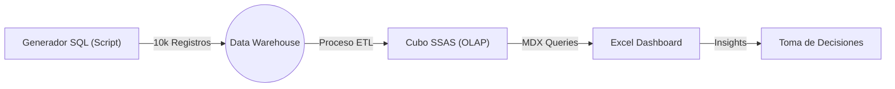

# ⚔️ Video Game Analytics: Sistema de Inteligencia de Negocios (BI)


> ### 🎓 Información Académica / Créditos
> * **Institución:** [INSTITUTO POLITÉCNICO NACIONAL]
> * **Carrera:** [ESCUELA SUPERIOR DE CÓMPUTO]
> * **Materia:** [BASE DE DATOS]
> * **Docente:** [GABRIEL HURTADO AVILÉS]
> * **Semestre/Grupo:** [3CV5]
> * **Equipo de Desarrollo:**
>     * 👤 [Rodriguez Salcedo Liam Ariel]
>     * 👤 [Sánchez Zenteno Diego Alejandro]

---

## 📖 Resumen Ejecutivo
Este proyecto implementa una solución integral de **Business Intelligence (End-to-End)** diseñada para analizar el comportamiento de jugadores en un videojuego MMORPG masivo. A través de la simulación de **10,000 partidas**, el sistema transforma datos transaccionales en conocimiento estratégico.

Utilizando **Microsoft Analysis Services (SSAS)**, se construyó un Cubo OLAP que permite a los analistas cruzar variables complejas (Tiempo, Geografía, Clase de Personaje) con métricas de rendimiento (XP, Oro) en milisegundos, visualizando los hallazgos en un Dashboard interactivo.

---

## 📐 Diseño del Cubo OLAP (Metadatos)
El núcleo del proyecto es el cubo multidimensional **`[Videojuego DW]`**. A continuación se detalla su estructura interna:

### 1. Grupos de Medida (Facts)
Estas son las métricas numéricas que se calculan automáticamente:

| Medida (Measure) | Tipo de Agregación | Descripción |
| :--- | :--- | :--- |
| **XP Ganada** | `SUM` | Total de puntos de experiencia acumulados por los jugadores. |
| **Oro Ganado** | `SUM` | Cantidad total de moneda virtual generada en el juego. |
| **Recuento de Partidas** | `COUNT` | Número total de sesiones de juego registradas. |
| **Duración Evento** | `SUM` / `AVG` | Tiempo total invertido por los jugadores en misiones. |
| **Nivel Resultante** | `MAX` | El nivel máximo alcanzado en el periodo analizado. |

### 2. Dimensiones (Contexto)
El cubo permite "rebanar" (slice) la información a través de los siguientes ejes:

* **📅 Dimensión Tiempo:** Jerarquía completa `Año > Trimestre > Mes > Día`. Permite análisis de estacionalidad.
* **🌍 Dimensión Jugador:** Información demográfica (`País`) y de cuenta (`Fecha de Registro`, `Correo`).
* **🛡️ Dimensión Personaje:** Arquetipos de juego. Incluye atributos como `Clase` (Guerrero, Mago...), `Raza` y `Nivel Inicial`.
* **🔥 Dimensión Evento:** Contexto de la partida. Clasifica las sesiones por `Tipo` (Raid, PVP, Farming) y `Dificultad` (Alta, Media, Baja).

---

## 📊 Arquitectura de la Solución

El flujo de datos sigue una arquitectura ETL (Extract, Transform, Load) clásica:


1. Fuente de Datos: Script SQL que simula un entorno transaccional, generando 10,000 registros con integridad referencial y distribución estadística aleatoria.
2. Data Warehouse: Base de datos Videojuego_DW modelada bajo un Esquema de Estrella (Star Schema).
3. Motor OLAP: Servidor Analysis Services que procesa y almacena las agregaciones para consultas instantáneas.
4. Frontend: Interfaz de usuario en Excel conectada en vivo al servidor.
## 🧠 Operaciones OLAP & Consultas MDX
Se implementaron consultas avanzadas utilizando el lenguaje MDX (Multidimensional Expressions) para demostrar la potencia del cubo:
1. 🔼 Roll-Up (Agregación)
Ver el total de XP agrupada por Año.
```
  SELECT { [Measures].[XP Ganada] } ON COLUMNS,
       { [Dim Tiempo].[Anio].MEMBERS } ON ROWS
FROM [Videojuego DW]
```
2. 🔽 Drill-Down (Desglose)
Profundizar en los meses del año 2024.
```
  SELECT { [Measures].[XP Ganada] } ON COLUMNS,
       { [Dim Tiempo].[Mes].MEMBERS } ON ROWS
FROM [Videojuego DW]
WHERE ( [Dim Tiempo].[Anio].&[2024] )
```
3. 🎲 Dice & Slice (Corte Multidimensional)
Filtrar: Clase 'Guerrero' + Dificultad 'Alta'.
```
  SELECT { [Measures].[Oro Ganado] } ON COLUMNS,
       { [Dim Personaje].[Clase].&[Guerrero] } ON ROWS
FROM [Videojuego DW]
WHERE ( [Dim Evento].[Dificultad].&[Alta] )
```
4. 🏆 Ranking (Top Count)
Los 5 jugadores más valiosos (MVP) por XP.
```
  SELECT { [Measures].[XP Ganada] } ON COLUMNS,
       TOPCOUNT( [Dim Jugador].[Nombre Usuario].MEMBERS, 5, [Measures].[XP Ganada] ) ON ROWS
FROM [Videojuego DW]
```
## 🛠️ Stack Tecnológico & Requisitos
| Componente | Tecnología | Rol en el proyecto |
| :--- | :--- | :--- |
| **Base de Datos** | SQL Server 2022 Developer | Almacén de datos (DW) |
| **IDE** | Visual Studio 2022 | Diseño y modelado del cubo |
| **Extensión** | SSAS Projects Extension | Plugin para modelos multidimensionales |
| **Gestión** | SSMS (Management Studio) | Ejecución de scripts y consultas MDX |
| **Visualización** | Microsoft Excel 365 | Dashboard interactivo y tablas dinámicas |
## ⚙️ Guía de Instalación y Ejecución
Sigue estos pasos para replicar el entorno de desarrollo:

Paso 1: Base de Datos
1. Abre SSMS y conecta a tu instancia local.
2. Abre el archivo /Database/script_generador_10k.sql
3. Ejecuta el script (F5). Esto creará la BD y poblará las tablas con 10,000 registros.

Paso 2: Servidor de Análisis
1. Abre el proyecto /SSAS_Project/CuboVideojuego_SQL.sln en Visual Studio.
2. Abre el archivo Videojuego DW.ds (Data Source).
3. Edita la Información de Suplantación: Selecciona "Usar usuario y contraseña de Windows" e ingresa tus credenciales de Administrador.
4. Menú Proyecto -> Implementar (Deploy).
5. Menú Proyecto -> Procesar (Process) -> Ejecutar.

Paso 3: Dashboard
1. Abre el archivo /Dashboards/Reporte_Interactivo.xlsx.
2. Ve a la pestaña Datos -> Actualizar todo.
3. ¡Listo! El reporte ahora muestra datos en tiempo real desde tu PC.

## 🚀 Posibles Mejoras (Trabajo Futuro)
- Implementación de KPIs (Key Performance Indicators) visuales (semáforos) dentro del cubo.
- Migración del Frontend a Power BI para visualizaciones web.
- Automatización del proceso de carga (ETL) mediante SSIS (Integration Services).

## 📂 Estructura del Repositorio
Cubo-de-Datos/
│
├── 📁 Database/           # Scripts T-SQL de generación de datos
├── 📁 SSAS_Project/       # Solución completa de Visual Studio
├── 📁 Dashboards/         # Reporte final en Excel (.xlsx)
